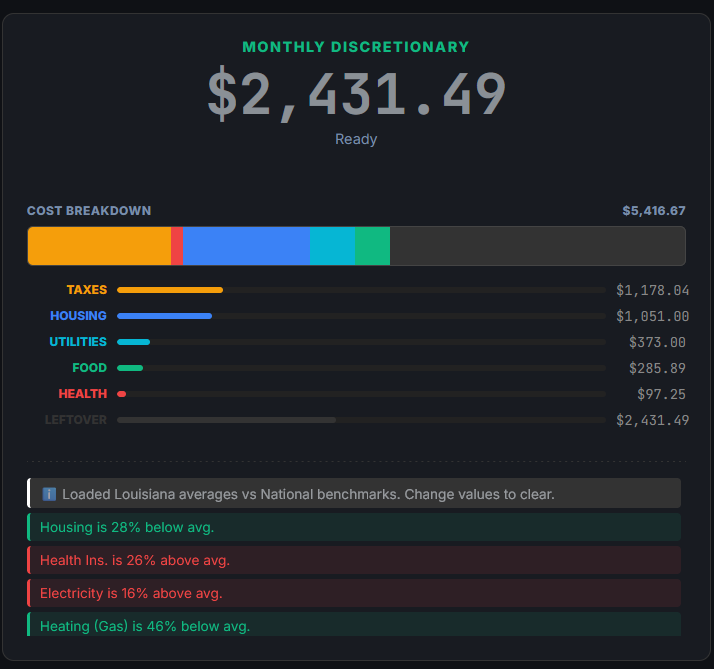

# BudgeterOS 💸

A privacy-focused, client-side budgeting dashboard that compares your living expenses against state and national averages.



## 🚀 Features

*   **Smart Benchmarking:** Instantly compares your Housing, Health, and Bills against data for your specific State (or National average).
*   **Privacy First:** No database, no accounts. Data is stored in your browser's LocalStorage only if you enable "Auto-Save".
*   **Universal Frequencies:** Enter bills as Weekly, Bi-Weekly, Monthly, or Annual. The engine normalizes everything to a monthly view.
*   **Real Tax Data:** Uses 2025 Tax Foundation brackets for Federal and State income tax calculations.
*   **Offline Ready:** Runs entirely in the browser using static JSON data files.

## 📂 Project Structure

```text
/
├── config/             # Source of Truth
│   ├── sources_map.json  # Data origins
│   └── states.json       # State codes
├── css/                # Styles
├── data/               # The "Brain" (Static JSON)
│   ├── geo_stats.json    # Cost of Living data
│   └── tax_tables.json   # 2025 Tax Brackets (Generated from real data)
├── js/                 # Application Logic
│   ├── app.js            # Controller
│   ├── calc.js           # Logic Engine
│   └── config.js         # Constants
└── scripts/            # Python Build Tools
    ├── ingest_data.py    # Builds geo_stats.json from CSVs
    ├── ingest_tax.py     # Builds tax_tables.json from Excel
    └── setup_wizard.py   # CLI to map new data sources
```

## 📊 Data Methodology

BudgeterOS uses **Nominal** (current dollar) public data for comparisons. All stats are normalized to **Monthly** costs.

### Cost Sources
*   **Housing:** Census Bureau 
*   **Food:** USDA Food Expenditure Series.
*   **Utilities:** EIA & World Population Review.
*   **Monthly Bills** doxo Insights BillPay data

### Tax Logic
We process raw tax bracket data using `scripts/ingest_tax.py`.
*   **Source:** Tax Foundation State Individual Income Tax Rates and Brackets (2025).
*   **Method:** The script converts "Floor-based" Excel data into "Cap-based" JSON logic for the engine.
*   **Calculations:** 
    *   **Federal:** Standard Deduction + Progressive Brackets + FICA (7.65%).
    *   **State:** Standard Deduction + Progressive Brackets based on specific state tax codes.

## 🛠️ Updates

### Updating Expenses
1.  Place new CSV files in `raw_data/`.
2.  Run `python scripts/setup_wizard.py` to map the file.
3.  Run `python scripts/ingest_data.py`.

### Updating Taxes
1.  Download the latest Tax Foundation data as `.xlsx`.
2.  Format it (Remove super-headers, ensure cols A-G are State/Rates/Brackets/Deductions).
3.  Save to `raw_data/tax_foundation_2025.xlsx`.
4.  Run `python scripts/ingest_tax.py`.

## 📦 Deployment

This project is designed for **GitHub Pages**.
Check it out at: https://wmjg-alt.github.io/budgeter/
